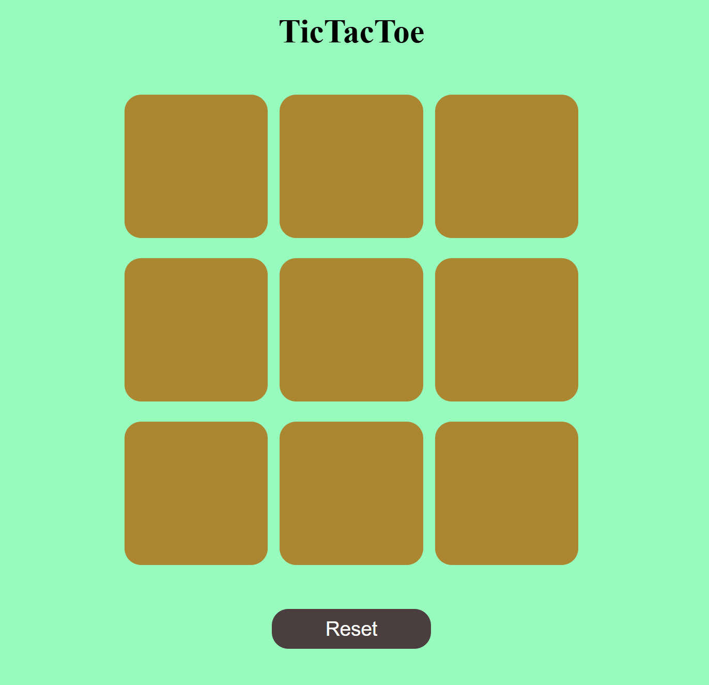
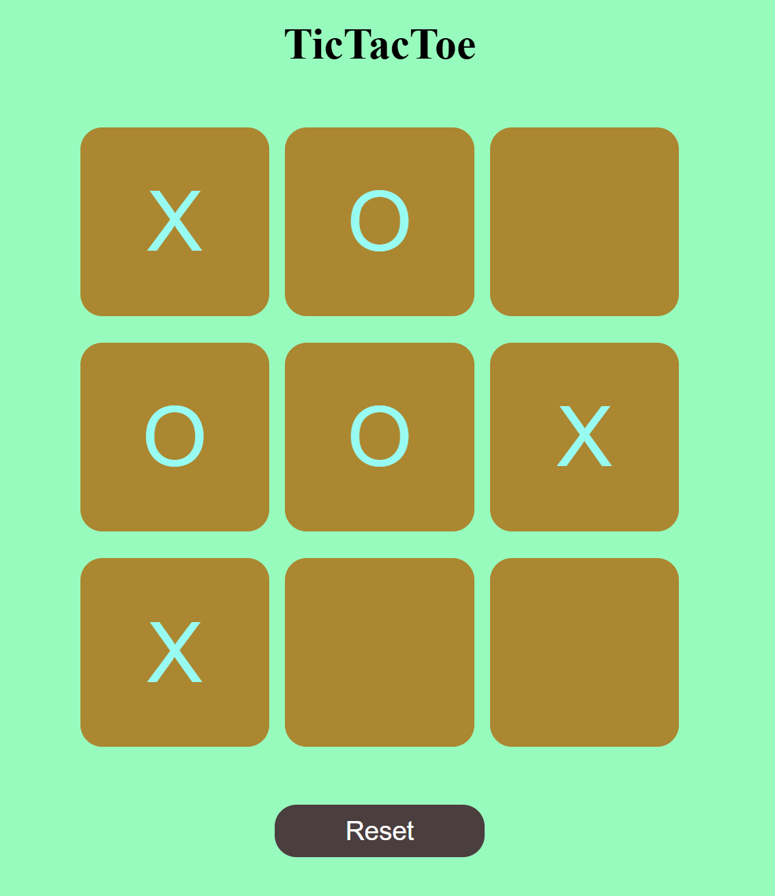
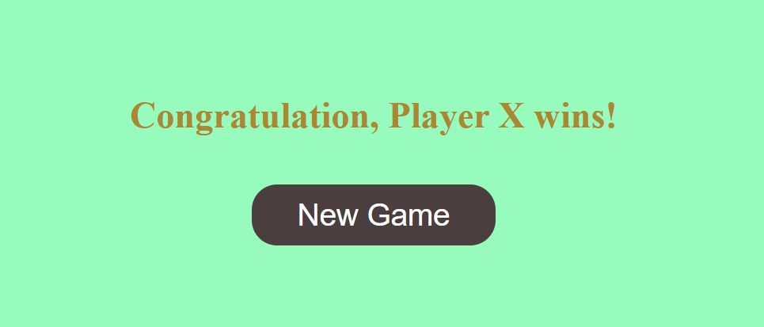

# TicTacToe 🎮 Tic Tac Toe Game (HTML | CSS | JavaScript)

A simple browser-based implementation of the classic **Tic Tac Toe** game. Built with vanilla HTML, CSS, and JavaScript — no frameworks or libraries.

---

## 🚀 Features

- Player vs Player mode (X and O)
- Dynamic turn switching
- Winning condition detection
- Reset and New Game buttons
- Winner announcement with styled UI

---

## 📁 Project Structure

---

## 🧠 How It Works

- **Game Board**: A 3x3 grid built using `<button>` elements.
- **Turn Logic**: Alternates turns between X and O.
- **Winner Check**: After every move, the game checks against all winning patterns.
- **End Game**: Shows a congratulatory message if someone wins.
- **Reset Game**: Clears the board while preserving the current session.
- **New Game**: Fully resets the game with UI state.

---

## 🖼️ UI Overview

- Responsive layout
- Colored background with stylized buttons
- Victory message overlay using a `.msg-container`
- `New Game` button appears only after a win

---

## 📷 Preview

---

## 🛠️ How to Run

1. Clone or download this repository.
2. Open `index.html` in your browser.
3. Play the game!

---

## 📄 License

This project is open source and free to use.

---
